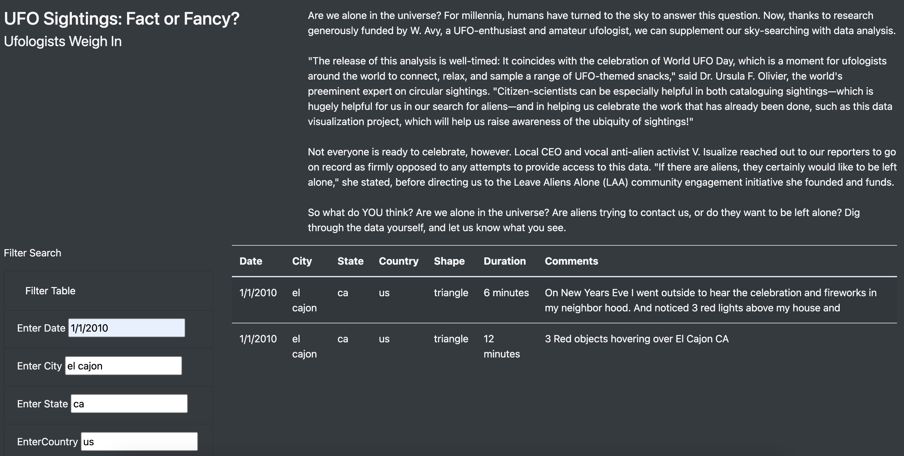

# UFO

## Project Overview 

JavaScript is one of the powerhouse languages out in the world today. While its strength is in creating visually appealing and dynamic content, it is starting to grow into other fields as well.

Javascript enhances websites by providing front-end functionality, customization, dashboards (such as maps or graphs), and allows for user input to create dynamic web pages. Javascript enables websites to be visually appealing and interactive.

In this repository, we will use Javascript to create a table that organizes UFO data that is stored as a JavaScript array, or list. This table will have the ability to filter data based on certain criteria and will be created using JavaScript as the primary coding language.

## Results 

The webpage created is a fairly user-friendly display of ufo sighting data with a filter table that allows users to easily filter on various criteria such as date, city, state, and shape of the UFO sighting. A unfiltered view can be seen below.

The displayed results are dynamically filtered as you update the form field entries.Filter selection can be broad such as only selecting a country and state like the United States, California. We can more filter down by Shape in this dynamic web page.

## Summary

Our current webpage has one main advantage in that users can search upon multiple criteria at one time and there is no submit button needed. However, there are also some drawbacks. 
* The main draw backs is search options don't provide much idea as to available options to search on. 
* The current fields are all text boxes and these can allow for a lot of user errors or just simply misinterpretation. This makes the data analysis ineffective and time consuming.
* The user may not know exactly what period the data is from, so the user might type in dates that we don't have data for. For the date filter, the user should be able to click through a calendar.

### Recommendations for further development:

* Drop down list of available options to be there on search.
* Add a calendar selection option instead of textbox field for the Date search.